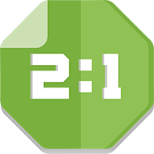

	

#Scored! 
> _Count everything !_

***Scored!*** is primarily meant to help keep each player's score while playing board games. Besides that, it can be used to keep count of anything at all.

##How to use

- Add up to 8 players
- Choose a colour and name for each player
- Click on start
- To increment a player's score, simply click on their tile
- To decrement a player's score, long click on their tile

##Thanks
- **[Jennifer Hall](https://www.instagram.com/yourcottonmouth/)** for the logo and German translation
- **[Przemek Gasinski](https://github.com/Soofe)** for the Polish translation

##License
    Copyright (C) 2016  Matteo Taroli
    
    This program is free software: you can redistribute it and/or modify
    it under the terms of the GNU General Public License as published by
    the Free Software Foundation, either version 3 of the License, or
    (at your option) any later version.
    
    This program is distributed in the hope that it will be useful,
    but WITHOUT ANY WARRANTY; without even the implied warranty of
    MERCHANTABILITY or FITNESS FOR A PARTICULAR PURPOSE.  See the
    GNU General Public License for more details.
    
    You should have received a copy of the GNU General Public License
    along with this program.  If not, see <http://www.gnu.org/licenses/>.