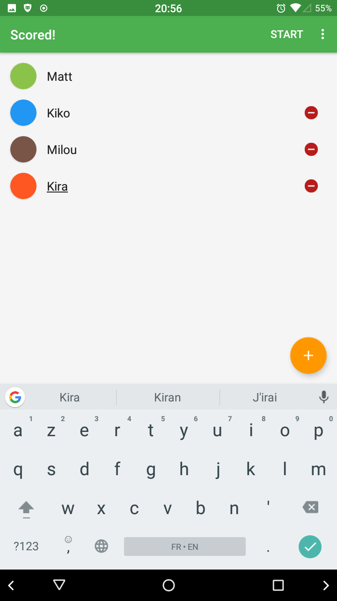
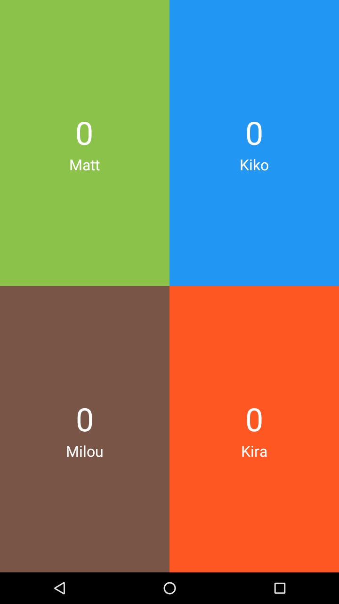
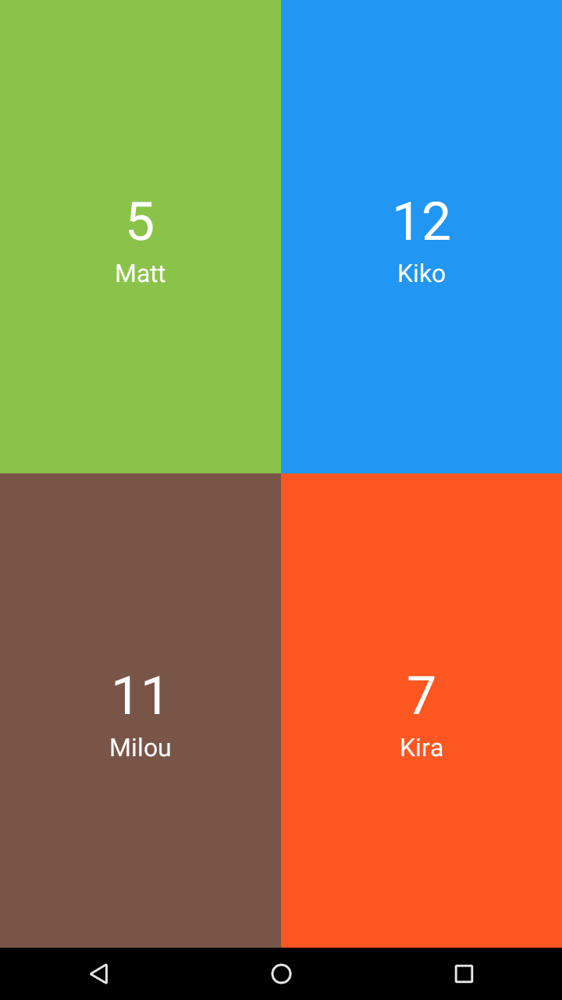

	

# Scored!
 

***Scored!*** is primarily meant to help keep each player's score while playing board games. Besides that, it can be used to keep count of anything at all.

## How to use
- Add up to 10 players
- Choose a color and name for each player
- Click on start
- To increment a player's score, simply click on their tile
- To decrement a player's score, long click on their tile

## Screenshots
||||
|:-:|:-:|:-:|
|Starting screen|Playing with my pets|Losing to my pets|

## Download
You can download the apk from those links :

- [Github](https://github.com/TotemaT/Scored-/releases/latest)
- [Google Play Store](https://play.google.com/store/apps/details?id=be.matteotaroli.scored)

## Thanks
- **[Jennifer Hall](https://www.instagram.com/yourcottonmouth/)** for the logo and German translation
- **[Przemek Gasinski](https://github.com/Soofe)** for the Polish translation
- Everyone who beta tested this app :)

## Libraries
***Scored!*** uses the following libraries :

- [ButterKnife](https://jakewharton.github.io/butterknife/)
- [HintCase](https://github.com/Nescafemix/hintcase)
- [Spectrum](https://github.com/the-blue-alliance/spectrum)

## License
    Copyright (C) 2016  Matteo Taroli

    This program is free software: you can redistribute it and/or modify
    it under the terms of the GNU General Public License as published by
    the Free Software Foundation, either version 3 of the License, or
    (at your option) any later version.

    This program is distributed in the hope that it will be useful,
    but WITHOUT ANY WARRANTY; without even the implied warranty of
    MERCHANTABILITY or FITNESS FOR A PARTICULAR PURPOSE.  See the
    GNU General Public License for more details.

    You should have received a copy of the GNU General Public License
    along with this program.  If not, see <http://www.gnu.org/licenses/>.
